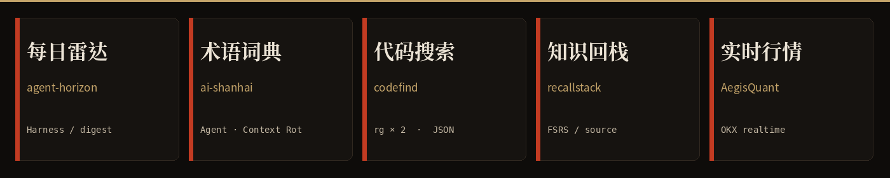

# profile-visual-template

GitHub 个人主页的可视化模板：水墨头图 + 五个四字项目卡。没有徽章墙，没有自定义 CSS。

Live 实例：[github.com/Q-xuan](https://github.com/Q-xuan) · 仓库 [`Q-xuan/Q-xuan`](https://github.com/Q-xuan/Q-xuan)

<p align="center">
  
</p>
<p align="center">
  
</p>

## 它是什么

GitHub 的 `github.com/USERNAME` 不能换皮肤。能自定义的几乎只有同名仓库 `USERNAME/USERNAME` 里的 `README.md`。

这个模板把那一页收成三件事：

1. `template/config.json` 里的文案和五个项目
2. `template/banner-source.png` 一张没字的背景
3. `scripts/compose_profile.py` 生成头图、卡片和主页 README

配套说明见 [`AGENT.md`](AGENT.md)。

## 提交到自己的 GitHub

### 方式 A：当成模板仓库用（推荐）

1. 打开本仓库，点 **Use this template** → Create a new repository
2. 仓库名必须等于你的 GitHub 用户名，且 **Public**
3. 改 `template/config.json`：`login`、`name`、两句中文、五张卡（标题四个汉字）
4. 在仓库根目录跑：

```sh
python3 -m pip install pillow
python3 scripts/compose_profile.py
```

5. 提交生成的 `assets/header.png`、`assets/works.png`、`README.md`

主页会显示这篇 README。本模板仓库自己的说明 README 会被覆盖，这是预期行为：同名仓库的 README 就是主页。

### 方式 B：拷进已经存在的 `USERNAME/USERNAME`

把 `AGENT.md`、`template/`、`scripts/` 拷进去，按上面 3–5 步走。不要手改 README 排版，以 config 为准。

## 依赖

- Python 3.10+
- [Pillow](https://pypi.org/project/Pillow/)
- 出图机子上要有 Noto CJK（宋/黑）和 DejaVu Sans Mono。Debian / 这个环境里是：
  - `/usr/share/fonts/opentype/noto/NotoSerifCJK-Bold.ttc`
  - `/usr/share/fonts/opentype/noto/NotoSansCJK-Regular.ttc`
  - `/usr/share/fonts/truetype/dejavu/DejaVuSansMono.ttf`

## 视觉规矩（短）

- 山在右边，保持干净，不要往山上铺词云
- 左侧可以留一行 geek 名词
- 五个中文标签必须四个字，且一看就知道在干什么
- 不要访客计数、trophy、streak 墙

完整规则在 `AGENT.md`。Q-xuan 正在用的一份 config 在 [`examples/config.q-xuan.json`](examples/config.q-xuan.json)。

## License

MIT
